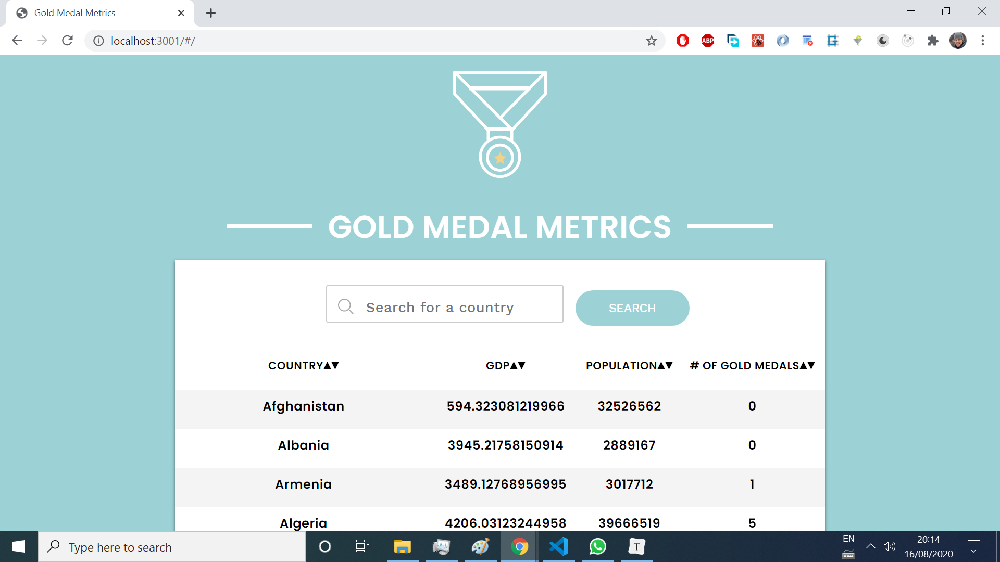
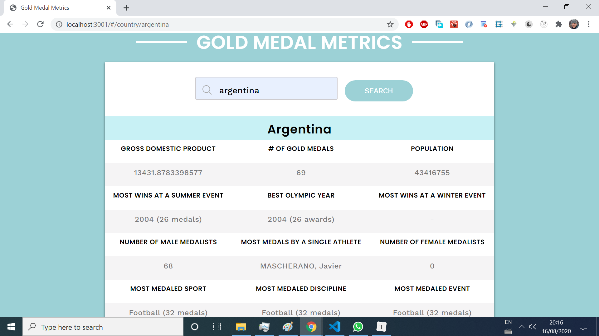
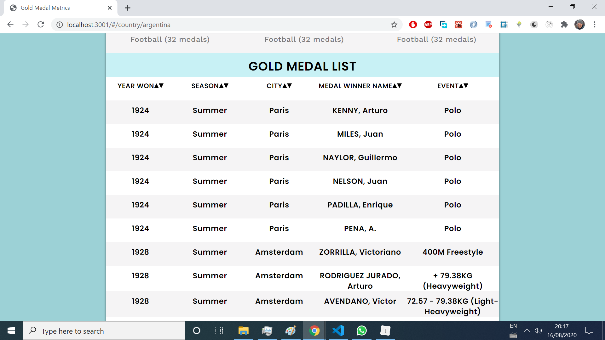
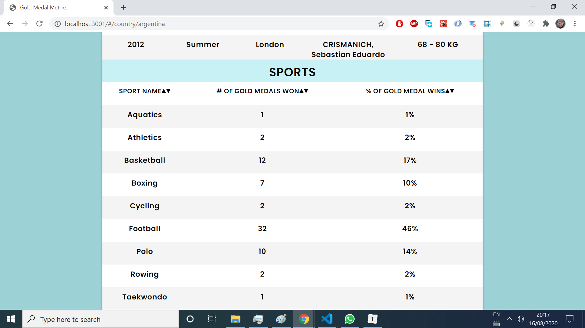

# Gold Medal Metrics

This is an Olympic metrics reporting web application called Gold Medal Metrics. It's a full-stack **SERN** App (SQL,  [Express](https://www.npmjs.com/package/express), [React](https://github.com/facebook/react) and [Node](https://nodejs.org/en/)).

Gold Medal Metrics allows users to:

 - View countries in a list with their population, GDP, and number of Olympic gold medals.
 - Sort the list of countries by any of these attributes, as well as alphabetically by name.
 - View a detailed description of a country, with statistics on their Olympic wins.
 - View a list of every Olympic win a country has with the year, season, winner name, city, and event.
 - Sort the list of Olympic wins by any of these attributes.

**The only file coded by the author is `sql.js`**, that contains helper JavaScript functions which return the **SQL queries** (as strings) that operate Gold Medal Metrics. **The remaining project files were NOT coded by the author.**


## Table of contents

* [General info](#general-info)
* [Screenshots](#screenshots)
* [Technologies](#technologies)
* [Setup](#setup)
* [Features](#features)
* [Status](#status)
* [Inspiration](#inspiration)
* [Contact](#contact)


## General info

This project was coded to learn how to write **SQL queries**.


## Screenshots

Image#1: Home screen




Image#2:  `/country/argentina` screen




Image#3: `/country/argentina` screen




Image#4 `/country/argentina` screen



## Technologies

* [React](https://github.com/facebook/react) - version 15.6.1,
* [Express](https://www.npmjs.com/package/express) -version 4.15.4,
* [Sqlite3](https://www.npmjs.com/package/sqlite3)  -version 4.0.6,
* [Node](https://nodejs.org/en/) -version 12.16.1


## Setup

* **Clone or download the repo.**

* **Install all the dependencies** listed on the`package.json` file by running:

  ```bash
  npm install
  ```

* **Compile the front-end files**:

  ```bash
  npm run webpack
  ```

* **Run the `server.js` file**:

  ```bash
  node server
  ```

* Now the app is served on https://localhost:3001.

* To **test the helper functions inside the `sql.js` file**:

  ```
  npm test
  ```

   You will see a list of tests that ran with information about whether or not each test passed. After this list, you will see more specific output about why each failing test failed.


## Features

These are the helper functions of the `sql.js` file, with its functionality:

#### createCountryTable

Returns the SQL command that creates a table, named `Country` with the following columns:

 - `name` a required text field.
 - `code` a required text field.
 - `gdp` an integer.
 - `population` an integer.

#### createGoldMedalTable

Returns the SQL command that creates a table, named `GoldMedal` with the following columns:

 - `id` an integer that will function as the primary key.
 - `year` a required integer.
 - `city` a required text field.
 - `season` a required text field.
 - `name` a required text field.
 - `country` a required text field.
 - `gender` a required text field.
 - `sport` a required text field.
 - `discipline` a required text field.
 - `event` a required text field.

#### goldMedalNumber

Takes an argument, the name of a country. Returns the SQL command that retrieves the number of gold medals that country has won in all Olympic games, aliased to the name `count`.

#### mostSummerWins

Takes an argument, the name of a country. Returns the SQL command that retrieves the year where the given country won the most summer medals, along with the number of medals aliased to 'count'

#### mostWinterWins

Takes an argument, the name of a country. Returns the SQL command that retrieves the year where the given country won the most winter medals, along with the number of medals aliased to 'count'

#### bestYear

Takes an argument, the name of a country. Returns the SQL command that retrieves the `year` that country won the most Olympic medals, and how many medals were won, aliased to the name `count`.

#### bestDiscipline

Takes an argument, the name of a country. Returns the SQL command that retrieves the `discipline` in which that country won the most Olympic medals, and how many medals were won, aliased to the name `count`.

#### bestSport

Takes an argument, the name of a country. Returns the SQL command that retrieves the `sport` in which that country won the most Olympic medals, and how many medals were won, aliased to the name `count`.

#### bestEvent

Takes an argument, the name of a country. Returns the SQL command that retrieves the `event` in which that country won the most Olympic medals, and how many medals were won, aliased to the name `count`.

#### numberMenMedalists

Takes an argument, the name of a country. Returns the SQL command that retrieves the number of men who have won Olympic medals for that country, aliased to the name `count`.

#### numberWomenMedalists

Takes an argument, the name of a country. Returns the SQL command that retrieves the number of women who have won Olympic medals for that country, aliased to the name `count`.

#### mostMedaledAthlete

Takes an argument, the name of a country. returns the SQL command that retrieves the `name` of the athlete who won olympic medals for that country, aliased to the name `count`.

#### orderedMedals

Takes three arguments, the name of the country and, optionally, a `field` to sort the results by and a boolean, `sortAscending` representing whether the list should be ascending in value (`true`) or descending (`false`). This function returns a SQL query that returns all fields for every Olympic medal won by the given country in the specified order, ascending or descending.

#### orderedSports

Takes three arguments, the name of the country and, optionally, a `field` to sort the results by and a boolean, `sortAscending` representing whether the list should be ascending in value (`true`) or descending (`false`). This function returns a SQL query that retrieves all the sports that country has received a Gold Medal in in the specified order, ascending or descending. Additionally the query returned returns the number of times the given country received a medal in that sport, aliased to the name `count`, furthermore the query calculates, as a percentage, how much of the country's Olympic gold medals were in that sport, aliased to the name 'percent'.

## Status

Project is _finished_. 


## Inspiration

This project was based on [CodeCademy's Web Development career path](https://www.codecademy.com/learn/paths/web-development).
